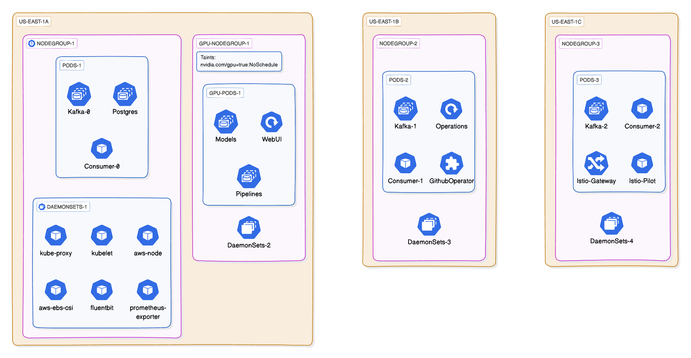

# K8s Infrastructure

## Overview

This project presents a highly scalable and flexible architecture for data processing and analysis, leveraging Kubernetes, Apache Kafka, and Large Language Models (LLMs). The system is designed to handle large-scale data ingestion, processing, and storage while providing an intuitive interface for querying and interacting with processed information.

## Architecture

The architecture is built on a Kubernetes cluster, utilizing its powerful orchestration capabilities. The system is composed of several key components distributed across multiple node groups for optimal performance and resource utilization.

## Kubernetes Cluster

The cluster is organized into multiple node groups, each serving specific purposes. The nodegroups shown in the diagram are examples, and the actual deployment can scale to include many more nodes and pods as needed. The infrastructure is setup using Terraform(IaC) on AWS EKS and managed using Helm charts.

### Node Groups

- `NodeGroup`: General-purpose nodes for running various services and workloads.
- `GPU-NodeGroup`: Dedicated to GPU-intensive tasks like model inference.

Each node group can host multiple pods, and the pods shown in the diagram are representative examples of the types of services that might run in each group.

### DaemonSets

These DaemonSets provide essential functionality across all nodes in the cluster, ensuring consistent operations and monitoring capabilities. The architecture includes several default DaemonSets:

- `kube-proxy`: Maintains network rules on nodes.
- `kubelet`: Ensures that containers are running in a Pod.
- `aws-node`: Manages AWS-specific networking features.
- `aws-ebs-csi`: Handles AWS Elastic Block Store operations.
- `fluent-bit`: Collects and forwards logs from all nodes.
- `prometheus-exporter`: Exports node-level metrics for monitoring.

## Key Components

### Namespaces and Network Flow

### Data Ingestion and Processing

The data ingestion and processing pipeline is designed for high throughput and scalability:

#### Kafka Cluster

Utilizes three Kafka brokers for fault-tolerant data streaming. This allows for parallel processing of incoming data streams and ensures high availability.

#### Consumers Groups

Multiple consumer groups process incoming data streams.

- `Webapp Consumer`: Inserts raw data into the database for further processing.
- `Ingestors`: LLM-based ingestors for advanced data processing and embedding generation. These ingestors use large language models to analyze and enrich incoming data, generating vector embeddings for efficient querying.

#### Kubernetes Operator

- `GithubReleaseMonitor`: A custom kubernetes operator that watches for new GitHub releases and triggers the data processing pipeline on a new release

- `GithubRelease`: A Custom Resource Definition (CRD) that represents a GitHub release. The operator creates a new GithubRelease object for each new release, triggering the data processing pipeline.

- `Job (Producer)`: A Kubernetes Job that produces data for processing, triggered by GitHub events or other external stimuli.

#### Custom Pipelines

- `Pipelines`: Custom data processing pipelines that can be tailored to specific data types or analysis requirements.

#### Storage

- `PostgreSQL Database`: Serves as the primary data store for processed information and embeddings. It's designed to handle large volumes of structured and semi-structured data efficiently.

#### User Interface and Querying

- `WebUI`: Provides a RAG-based (Retrieval-Augmented Generation) querying interface. This allows users to interact with the system using natural language queries.
- `LLM Models`: Integrated for advanced query processing and response generation. These models can understand complex queries and generate human-like responses based on the processed data.

#### Monitoring and Operations

- `Prometheus & Grafana`: Offer comprehensive monitoring and visualization of system metrics, allowing for real-time performance tracking and anomaly detection.
- `Fluent Bit`: Handles log collection and forwarding, ensuring centralized log management for easier troubleshooting and analysis.
- `Istio`: Implements service mesh for enhanced network communication, security, and observability. It includes components like Istio Gateway and Istio Pilot for traffic management and service discovery.
- `Cluster Autoscaler`: Automatically adjusts the size of the Kubernetes cluster based on resource demands, ensuring optimal resource utilization.
- `External DNS & Cert Manager`: Manage DNS records and SSL/TLS certificates automatically, simplifying external access and security configuration.

#### Scalability and Performance

The architecture is designed to scale horizontally, allowing for the addition of more nodes and pods as demand increases. The use of Kubernetes allows for efficient resource allocation and automatic scaling of components based on load.
