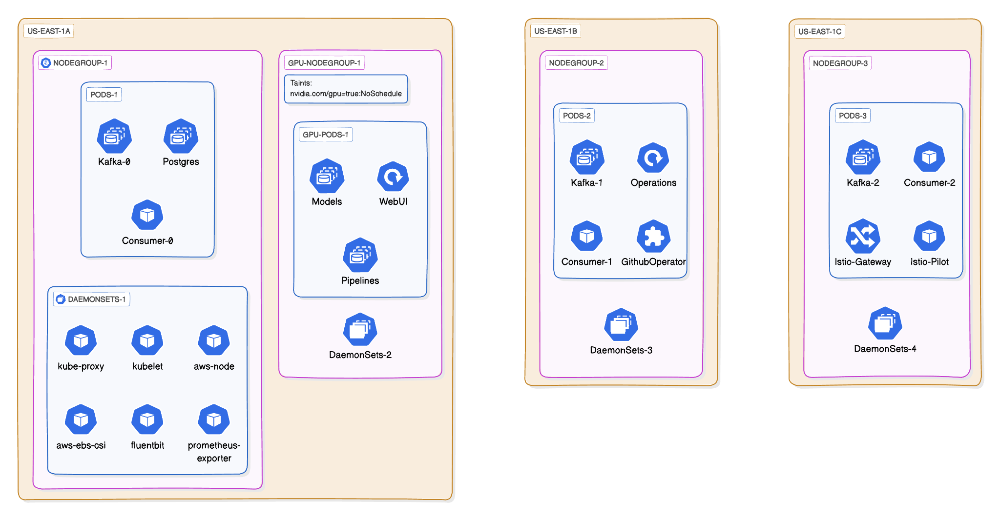

# K8s Infrastructure

## Overview

This project presents a highly scalable and flexible architecture for data processing and analysis, leveraging Kubernetes, Apache Kafka, and Large Language Models (LLMs). The system is designed to handle large-scale data ingestion, processing, and storage while providing an intuitive interface for querying and interacting with processed information.

## Architecture

The architecture is built on a Kubernetes cluster, utilizing its powerful orchestration capabilities. The system is composed of several key components distributed across multiple node groups for optimal performance and resource utilization.

## Kubernetes Cluster

The cluster is organized into multiple node groups, each serving specific purposes. The nodegroups shown in the diagram are examples, and the actual deployment can scale to include many more nodes and pods as needed.

### Node Groups

- `NodeGroup`: General-purpose nodes for running various services and workloads.
- `GPU-NodeGroup`: Dedicated to GPU-intensive tasks like model inference.

Each node group can host multiple pods, and the pods shown in the diagram are representative examples of the types of services that might run in each group.

### DaemonSets

These DaemonSets provide essential functionality across all nodes in the cluster, ensuring consistent operations and monitoring capabilities. The architecture includes several default DaemonSets:

- `kube-proxy`: Maintains network rules on nodes.
- `kubelet`: Ensures that containers are running in a Pod.
- `aws-node`: Manages AWS-specific networking features.
- `aws-ebs-csi`: Handles AWS Elastic Block Store operations.
- `fluent-bit`: Collects and forwards logs from all nodes.
- `prometheus-exporter`: Exports node-level metrics for monitoring.
